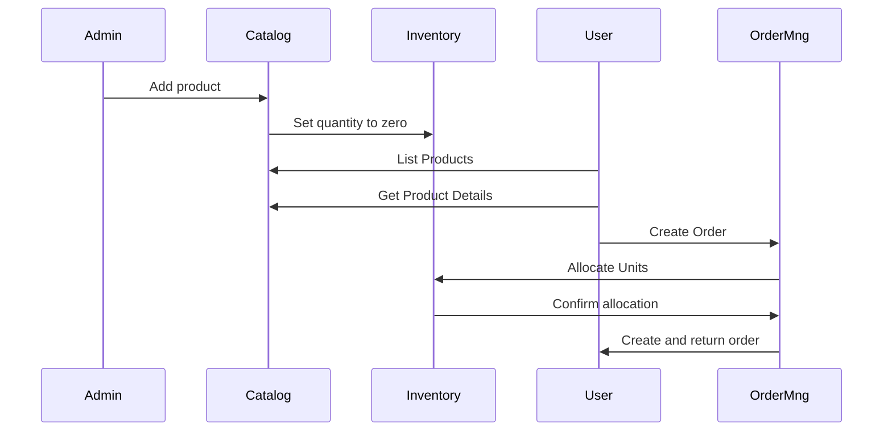

# Micro Store

Mini project of a small store system implementing three microservices:

- Product Catalog
- Inventory Management
- Order Management

## Product Catalog

This service handles the products details, from price to description. 

Product lifecycle starts here, by adding a product to the catalog it's unique ID gets generated.

After that this ID gets used to increase and manipulate inventory through the following service.

## Inventory management

This service handles the product inventory, enables an interface to allocate or deallocate a quantity of items
by product.

## Order management

The Order Management Microservice will handle the overall process of managing customer orders. 
This includes operations such as creating an order, 
retrieving order details, updating an order status, or deleting an order.

# Process Flow

A common flow of how things should work.

